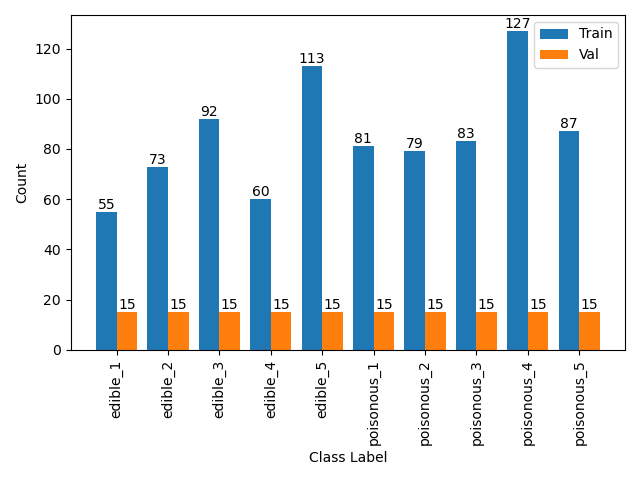
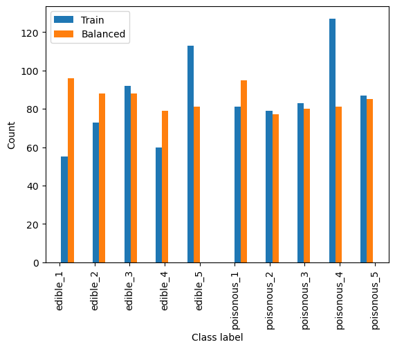
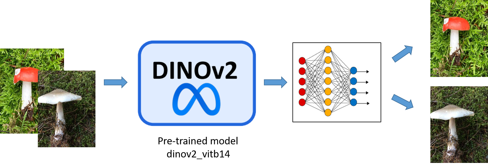
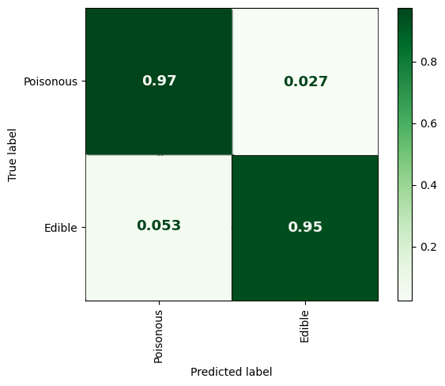
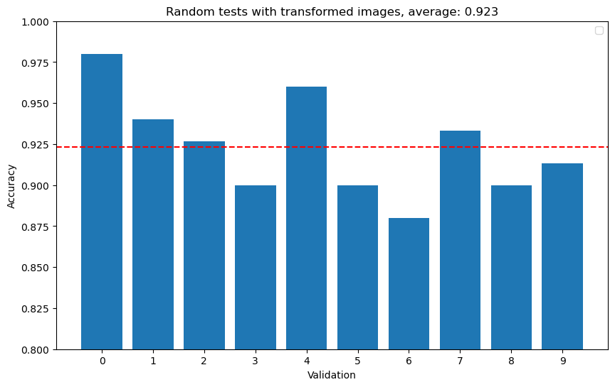
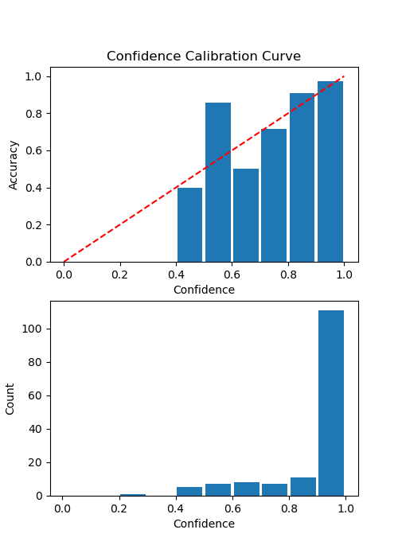
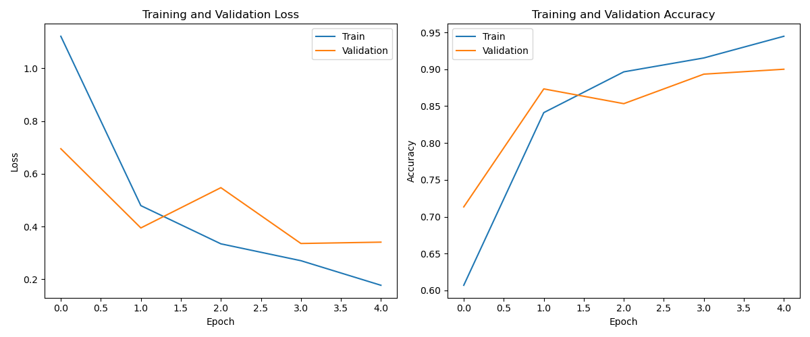
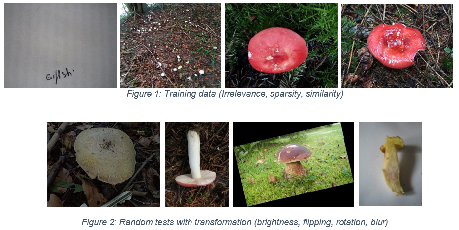

# Automated Fungi Classification
## I. Brisbane Flora and Fauna Society (fictitious) - Business requirements-
Data credit-
Data credit- Picek, Lukáš, et al. "Danish fungi 2020-not just another image recognitio-ndataset."
Proceeding- of the IEEE/CVF Winter Conference on Applications of Computer Vision. 202-.

### 1. Background
The Brisbane Flora and Fauna Society (BFFS) is a not-for-profit committed to the preservation, protection, and enhancement of Brisbane's diverse ecosystem. BFFS is composed of dedicated environmental enthusiasts, biologists, and volunteers who work tirelessly to safeguard the region's rich biodiversity, focusing specifically on the city's unique flora and fauna. Through education, conservation initiatives, community participation, and collaboration with government and non-government entities, BFFS is a frontline guardian of Brisbane's natural heritage, balancing
urban development with ecological sustainability.

### 2. Project Motivation
With increasingly tropical weather, we have observed that more and more fungi are emerging in Brisbane parklands, backyards, and surrounding hinterland. Some of these species are harmless and edible by humans and wildlife, while others are poisonous and can be very dangerous if consumed. While fungi are essential for the biodiversity of an ecosystem, we are aware of increasing reports of poisonings of humans, their pets, and local wildlife. We plan to create a mobile app where members of the public can upload photos of fungi and the app will identify the species and state if it is ‘edible’ or ‘poisonous’. This will improve the education
of the public on fungi, allowing them to make informed decisions. This is a careful balance – we want to encourage people to appreciate and foster non-dangerous species, while also encouraging the removal of poisonous species of fungi.

### 3. Project Description
We want you to complete a study into the feasibility of using ML to classify fungi species from photos. We have collected data for 5 different edible species and 5 different poisonous species. We provide you with a dataset folder, where you will find images from the 10 different species, sorted into individual species folders that indicate if the species is ‘edible’ or ‘poisonous’. We have used one of our trained experts to label this data. There are between 70-142 labelled images for
each fungi species, with a total of 1001 images. We additionally have a held-out test set of 500 images, with 50 images per fungi species, that we will use to evaluate the performance of the ML method you design.

## II. Analytical report
### 1.  Business task:
A mobile app where members of the public can upload photos of fungi and the app will identify the species and state if it is edible or poisonous. This will raise the perception of the public on fungi so that people can foster non-dangerous species, while also encouraging the removal of poisonous species of fungi.

### 2. Data evaluation:
The collection contains approximately 1000 images from 10 different species, 5 are edible and 5 are poisonous. For each subset, 15 images, which are 20% of the smallest subset, were kept for validation to balance between training capacity and model evaluation

From the above figure, there is obviously the imbalance in the dataset. The instances with "poisonous" labels are remarkably greater than "edible" ones. In general, "poisonous_4" contains the highest number of instances, even double that of "edible_4", followed by "edible_5". The other two species of edible fungi, which are "edible_1" and "edible_4", obtain the smallest counts among the categories. To overcome this imbalance, data balancing was applied.

### 3. Solution
Input images were transformed to tensor based on ImageNet datasets to fit into the model. Several transformers (flipping, rotation, blur) were also applied to enhance the learning capability. Using DINOv2 (vitb14) as the Foundation model, the suggested machine learning model then converts 768 Dino’s features to 10 features to fit 10 fungi classes, adopting a simple neural network with one hidden layer.

### 4. Results
The results show that my model achieved a high level of accuracy for the case study, in which poisonous classes are likely to be correctly predicted for 97%. Due to some limitations from data quality, trade-off between accuracy and generalisation, further improvement can be considered. 

### 5. Discussion
Achievements:
-   The model performs at a high level of accuracy for user-case.
-   Poisonous classes are likely to be correctly predicted.
-   The prediction confidence is well-calibrated in general.

Challenges:
-	Data imbalance among classes.
-	Input quality needs to be considered.
-	Limited resources and constraints.
-	Overfitting during long periods of model trainings.
-   Trade-off between accuracy and generalisation.
-	Feature shifts and novel classes.

Recommendation:
-	Increasing the amount of data to train model with balancing sampling.
-	Improving the quality of input (different perspectives, diversity, relevance).
-	Adopting better machine learning models/architectures or combine them.
-	Tuning hyperparameters and optimizers.

### Appendix
During the training and validation phases, early stopping was applied to prevent overfitting and time-consuming. The gaps in the figure are magnified just to clarify as they are very close.

Figure 1 shows several issues in traning datasets such as the ambiguous figures of fungi, sparsity, and similarity between **edible** and **poisonous** types. On the other hand, figure 2 illustrates a couple of effective techniques to enrich the quality of inputs.

